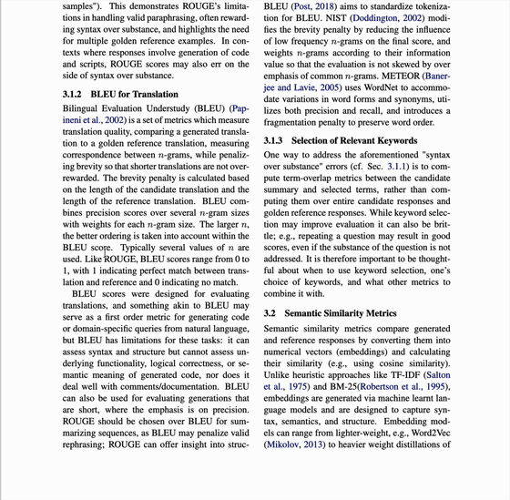
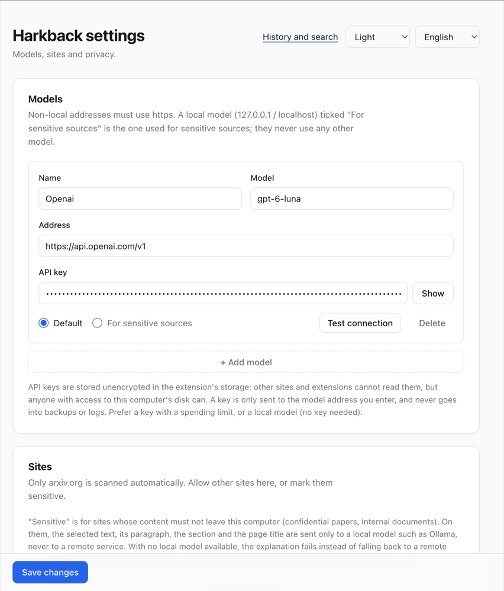

# Harkback

**English** · [简体中文](README.zh-CN.md)

**Explain terms while you read. Remember what you understood. Get it back when you meet the term again.**

Harkback is a Chrome extension for people who read papers and technical documents. Select a term and it explains the term in context. Every explanation is kept in a local, append-only log. When the same term shows up on a later page, even under another spelling, Harkback underlines it and shows what you understood last time.

> "harken back": to return to an earlier point.

[](assets/demo.mp4)

_Select a term in a PDF, ask a follow-up, and the whole conversation is kept. Click the animation for the full-quality video._

## Contents

- [Why not just ask ChatGPT?](#why-not-just-ask-chatgpt)
- [Features](#features)
- [Your knowledge graph](#your-knowledge-graph)
- [How it works](#how-it-works)
- [Install](#install)
- [Connect a model](#connect-a-model)
- [Using Harkback](#using-harkback)
- [Privacy](#privacy)
- [Your data](#your-data)
- [Limitations](#limitations)
- [Repository layout](#repository-layout)
- [Development](#development)
- [Contributing](#contributing)
- [License](#license)

## Why not just ask ChatGPT?

You can paste a term into a chatbot and get a good answer. Harkback does not try to give a better answer. It adds the part a chat window lacks: **memory**. Every term you look up becomes a record tied to the page, the quote and the date, and the records are connected into a knowledge graph that belongs to you.

|                    | Asking a chatbot                                 | Harkback                                                                                          |
| ------------------ | ------------------------------------------------ | ------------------------------------------------------------------------------------------------- |
| **Context**        | Copy the term and some text, switch tabs         | Select the term on the page; its paragraph and section go with it, and the quote is verified      |
| **Next time**      | A new chat starts empty, or you forget you asked | The term is underlined on later pages, with what you understood last time                         |
| **Structure**      | A pile of transcripts                            | Concepts with aliases, prerequisites, variants and related terms                                  |
| **Retention**      | None                                             | A review queue: confused terms return after a day, remembered ones after 3, 7, 14, 30 and 60 days |
| **Your records**   | Live in the provider's account                   | Stay in your browser; export Markdown, Obsidian notes or JSONL                                    |
| **Model and cost** | One service, one plan                            | Any of the supported models: local Ollama costs nothing, or use your own API key                  |

Harkback is free and open source (Apache-2.0), has no server and no subscription. It does need a model to write the explanations: a local model is free, and a hosted one is billed by its provider to your own key.

## Features

- **Explain in context.** Select a term, click _Explain_ or press `Alt+E`. The answer streams in from the model you configured and is marked _defined in source_ (the page defines the term, and the quote is verified against the page text) or _external knowledge_.
- **Remember.** Each explanation, follow-up question and "got it / still confused" mark is stored as an event in IndexedDB. Nothing leaves your browser except the model request you trigger.
- **Follow-up conversations.** Ask more on the card; each question stays above its answer, and the conversation is saved with the explanation. History shows it in full, and search finds it. Formulas are typeset.
- **Reunions.** On later pages, terms you have looked up are underlined. Hover to see when and where you met the term and what you understood, then mark it remembered, explain it again, compare the two usages, or mute it.
- **One concept, many spellings.** `LLM`, `LLMs`, `the LLM`, `large language model` and `Large-Language Models` are the same concept. So are `β-VAE` and `beta-VAE`, and `fine-tuning` and `fine-tuning` with a ligature. Near matches are put to you as "is this the term you looked up 3 days ago?".
- **Related terms.** If a model says `QLoRA` is a variant of `LoRA`, a page that only mentions `QLoRA` reminds you of what you understood about `LoRA`.
- **Concept pages.** Open any term in History to see how well you understood it, what it builds on (prerequisites), its variants and related terms, and every time you met it. You can add an alias, merge two concepts that are the same, remove a wrong relation, or mute a term.
- **Review.** History shows a _Review_ button with the number of terms due. Terms you were confused about come back after a day; terms you remembered come back after 3, 7, 14, 30 and 60 days. The toolbar icon shows the same number, and every term shows when it is due and what each answer does to its schedule.
- **Builds on what you know.** When a term you look up is close to one you already understand, the model is told so and can explain the difference instead of starting over.
- **Private by design.** Automatic scanning is limited to arxiv.org. Sensitive sites can be forced onto a local model, and private windows never record or scan.
- **Portable records.** Export everything as Markdown, or as a folder of linked notes (one file per concept with `[[links]]`, ready for Obsidian), or as a versioned JSONL event log with a published JSON schema. A weekly JSONL backup is written to `Downloads/harkback`.
- **Your choice of model.** Ollama, OpenAI, Anthropic, Google Gemini, xAI Grok, OpenRouter, or any OpenAI-compatible server. Anthropic and Gemini use their native APIs.

## Your knowledge graph

Each look-up adds to a graph of what you have read, built from your own reading rather than from a general-purpose model's memory.

- **Concepts are the nodes.** `LoRA` is one node, whatever spelling a page uses (`LoRA`, `low-rank adaptation`). It keeps its aliases, its field and how well you understood it.
- **Relations are the edges.** A model proposes `variant_of`, `prerequisite` and `related` links when you look a term up, for example `QLoRA` is a variant of `LoRA`. You can remove a wrong one, merge two concepts that are the same, or add an alias.
- **Everything points back to evidence.** A concept lists every encounter: the page, the quote, the date, your explanation and the follow-up conversation.
- **The graph does work.** A page that only mentions `QLoRA` reminds you of `LoRA`, the model is told what you already know so it can explain the difference, and review is scheduled per concept.
- **It is yours.** Export a folder of linked notes (`[[links]]`, one file per concept) and open it in Obsidian to see the graph there, or export the full event log as JSONL.

There is no built-in graph view yet. You browse the graph through concept pages in History, and through Obsidian after exporting.

## How it works

```
 read                explain                 remember                 recall
 ────                ───────                 ────────                 ──────
 content script  →   background worker   →   append-only event log →  matcher scans the next page
 extracts page       routes to a model       (IndexedDB), replayed      for known names, picks the
 text, tracks        by site sensitivity,    into concepts, aliases     concepts worth showing, and
 your selection      streams the answer,     and encounters             draws the underline + card
                     resolves the concept
```

1. **Read.** A content script extracts the readable text of the page (LaTeXML structure on arXiv, Readability elsewhere) and keeps a map from text offsets back to DOM nodes.
2. **Explain.** The background worker checks the site rules, picks a model, applies a local rate limit, and sends the term with its paragraph. The prompt lists known concepts as candidates so the model can say "this is the same concept as c1". The reply is parsed defensively: truncated cards, trailing commas and decorated labels are tolerated.
3. **Remember.** The result becomes events (`concept.created`, `encounter.created`, `edge.proposed`, ...). Concepts, aliases and merges are derived by replaying the log, never stored, so a better matching rule improves old records too.
4. **Recall.** On each page an Aho-Corasick matcher scans the text for every known name and abbreviation. Reunion selection then applies the rules that keep it useful: not on the page where you looked the term up, not within a minimum gap, muted concepts stay muted, and an ambiguous abbreviation needs a second term from the same field on the page.

## Install

Requires Node 22 or newer and [pnpm](https://pnpm.io). There is no store listing yet, so load the extension from source:

```sh
# from the repository root
pnpm install
pnpm --filter @harkback/extension build
```

Open `chrome://extensions`, enable **Developer mode**, choose **Load unpacked**, and select `apps/extension/.output/chrome-mv3`. The onboarding page opens on install.

## Connect a model

Onboarding walks you through this, and you can change it later on the settings page.



| Provider      | Base URL                                           | Notes                                 |
| ------------- | -------------------------------------------------- | ------------------------------------- |
| Ollama        | `http://127.0.0.1:11434/v1`                        | Local, no key. See below.             |
| OpenAI        | `https://api.openai.com/v1`                        | Needs an API key.                     |
| Anthropic     | `https://api.anthropic.com/v1`                     | Needs an API key.                     |
| Google Gemini | `https://generativelanguage.googleapis.com/v1beta` | Needs an API key.                     |
| xAI Grok      | `https://api.x.ai/v1`                              | Needs an API key.                     |
| OpenRouter    | `https://openrouter.ai/api/v1`                     | Needs an API key.                     |
| Custom        | any address                                        | Non-local addresses must use `https`. |

Each provider speaks its own format: Anthropic and Google Gemini use their native APIs, and everything else, including Ollama, Grok, OpenRouter and any custom address such as a company proxy, uses the OpenAI-compatible format. Picking a provider fills in its address, which you can still edit. Choose **Custom** for any other OpenAI-compatible service.

Chrome asks you to allow access to the model's address the first time you test or save it. If you decline, the explain card says so instead of failing with a network error.

**Ollama** rejects requests from browser extensions unless the extension's origin is allowed. The _Test connection_ button shows the exact command for your system, for example on macOS:

```sh
launchctl setenv OLLAMA_ORIGINS "chrome-extension://<your-extension-id>"
```

then restart Ollama.

## Using Harkback

| You want to                       | Do this                                                                                        |
| --------------------------------- | ---------------------------------------------------------------------------------------------- |
| Explain a term                    | Select it and click **Explain**, or press `Alt+E`.                                             |
| Ask more                          | Use **Ask more** on the card. The question and answer are saved with the explanation.          |
| Scan a page that is not on arXiv  | Click the toolbar button, or allow the site under _Sites_ in settings for automatic scans.     |
| Read a PDF                        | Click the toolbar button on the PDF: arXiv papers open as HTML, other PDFs open in the reader. |
| See what you have looked up       | Open the history page from the settings page or the onboarding page. It updates live.          |
| Keep your records                 | History page → **Export Markdown** or **Back up JSONL now**.                                   |
| Stop a term from being underlined | Hover the underline → **Don't show again**.                                                    |
| Keep a source off remote models   | Card → **Mark source as sensitive**, or add a sensitive rule for the site in settings.         |

## Privacy

- When you ask for an explanation, the selected text, its paragraph, the section and the page title go to the model service you configured, under that provider's terms.
- Records stay in this browser. Backups contain records only, never settings or API keys.
- Pages are scanned automatically only on arxiv.org. Anywhere else you must click the button, press `Alt+E`, or allow the site.
- Content from a sensitive source is never sent to a non-local model, including as context for later comparisons.
- Private windows explain but never record, scan or show reunions.
- Reunion underlines live in the page, so the page's own scripts may infer which terms you have records for.
- Deleting an explanation removes it in the app; traces may remain on disk and exported backups cannot be recalled.
- API keys are stored **unencrypted** in the extension's storage.

The notes shown in the extension are the source of truth: [`apps/extension/src/lib/pages/privacy.ts`](apps/extension/src/lib/pages/privacy.ts).

## Your data

Everything is an event in an append-only log. The format is public:

- Event types and payloads: [`packages/spec`](packages/spec), with the generated [JSON schema](packages/spec/schema/event.schema.json).
- Replay, matching and export: [`packages/core`](packages/core), which has no browser dependencies and can be used on its own.

Because concepts and aliases are derived from the log, your JSONL backup is a complete, portable copy of what you know.

## Limitations

- Chrome (Manifest V3) only.
- Explanations depend on the model you choose; small local models may produce weaker concept cards, which lowers recall quality but never breaks recording.
- Text in a browser's built-in PDF viewer cannot be read, so Harkback opens the PDF in its own reader page (arXiv papers go to the HTML version instead). Scanned PDFs have no text and are not supported, there is no OCR, and paragraph detection on complicated layouts (tables, figures with text, three or more columns) is approximate. A PDF on your computer needs two approvals: turn on "Allow access to file URLs" for Harkback in `chrome://extensions`, then click "Allow local files" on the reader page the first time.
- Automatic abbreviation matching needs at least three words in the full name (`LLM` from `Large Language Model`). Two abbreviations that map to different full names in the same field (for example two different "GNN"s) are kept as separate concepts.
- Chinese names, and Japanese names written only in kanji, must be at least three characters to be underlined, to avoid false positives. Names with kana or Hangul need two.
- Accents are ignored when matching ("résumé" and "resume" are one term), but there is no stemming for languages other than English, so inflected forms such as German plurals are separate terms.
- The interface is available in English, Simplified and Traditional Chinese, Japanese, Korean, Spanish, French, German and Brazilian Portuguese. Explanations can be written in 16 languages, chosen separately in settings. Exported notes and Markdown use English or Chinese labels only.

## Repository layout

| Path             | What it is                                                                                                                       |
| ---------------- | -------------------------------------------------------------------------------------------------------------------------------- |
| `packages/spec`  | The event format: constants, zod schemas, and the generated JSON schema.                                                         |
| `packages/core`  | Pure logic: replay, name normalization, concept matching, reunion selection, prompts, output parsing, JSONL and Markdown export. |
| `apps/extension` | The Chrome extension, built with [WXT](https://wxt.dev): content script, background worker, history, settings and onboarding.    |
| `tools/lint`     | ESLint setup.                                                                                                                    |

## Development

```sh
pnpm install
pnpm --filter @harkback/extension dev     # live reload
```

Before opening a pull request:

```sh
pnpm typecheck     # all packages
pnpm lint          # ESLint
pnpm test          # unit tests
pnpm check:build   # production build: manifest permissions and content-script size
pnpm e2e           # end-to-end tests in Chromium (run `pnpm exec playwright install chromium` once)
pnpm format:check  # formatting
```

To package a release for the Chrome Web Store, bump `version` in `apps/extension/package.json`, then run `pnpm release`. It runs the checks, builds the production extension, verifies the package and writes `apps/extension/.output/harkback-<version>-chrome.zip`. Use `tools/package.sh --skip-checks` to only build the zip.

The end-to-end tests load the built extension into Chromium, serve arXiv pages from `apps/extension/fixtures`, and talk to a local stub model server. They cover the whole loop: reading a paper, explaining, recording, the history page, and reunions on other papers. See `apps/extension/e2e`.

## Contributing

Bug reports and pull requests are welcome. Read [CONTRIBUTING.md](CONTRIBUTING.md) first. To report a security problem, see [SECURITY.md](SECURITY.md).

## License

[Apache-2.0](LICENSE)
